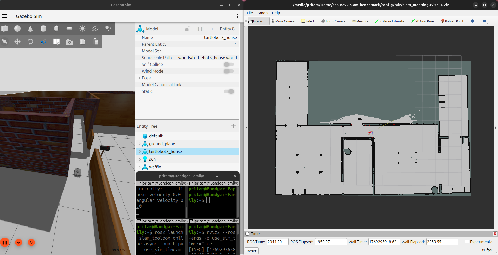
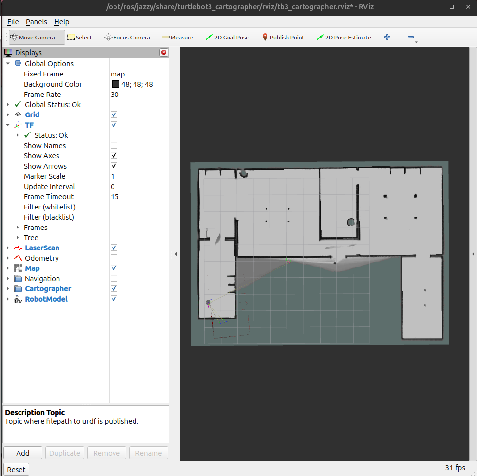
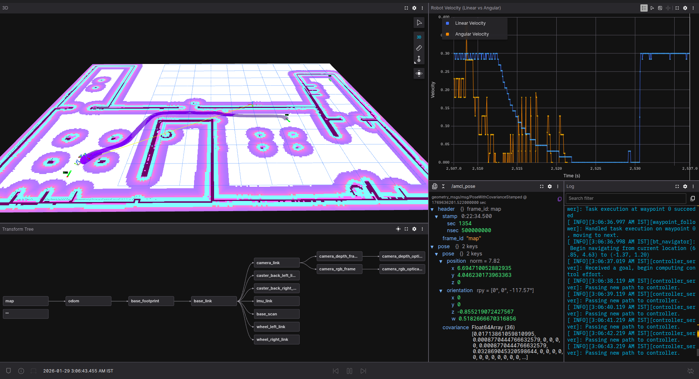
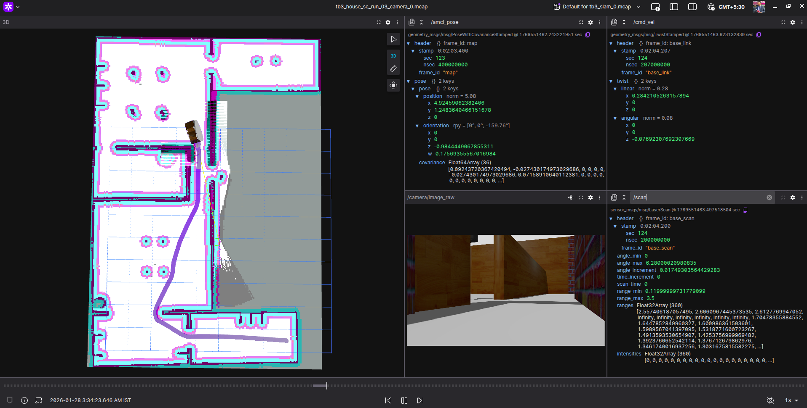
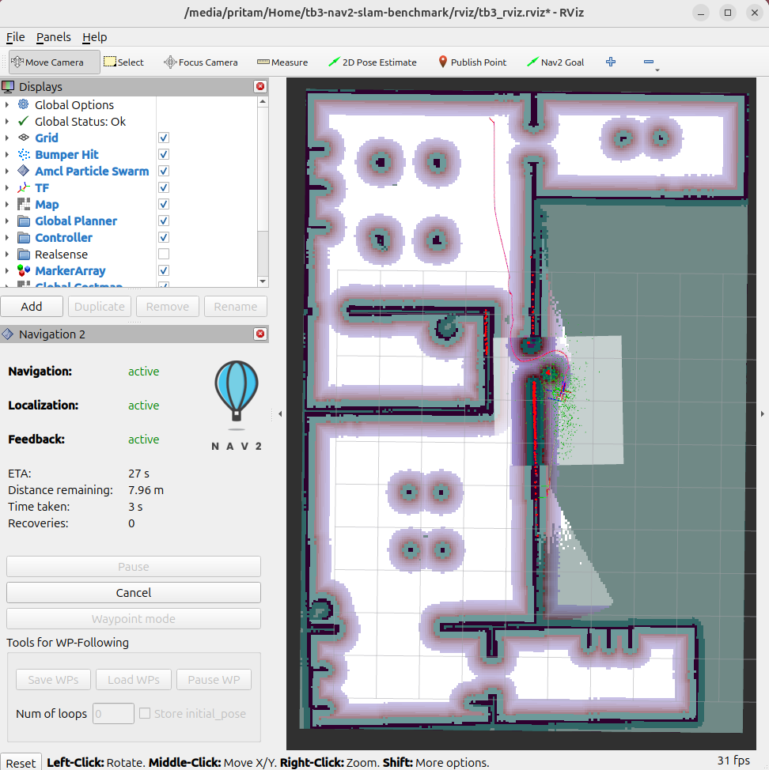
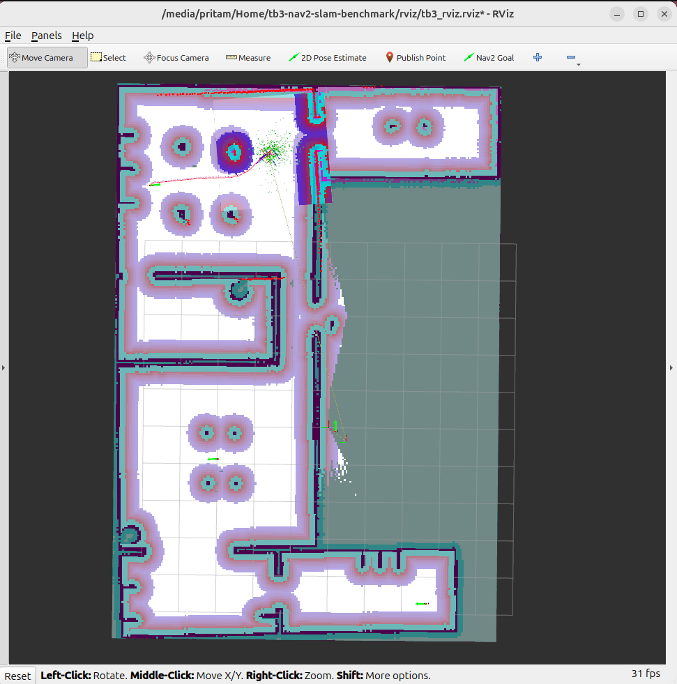
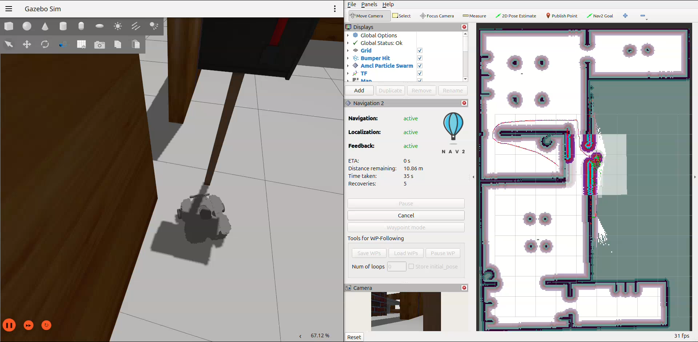
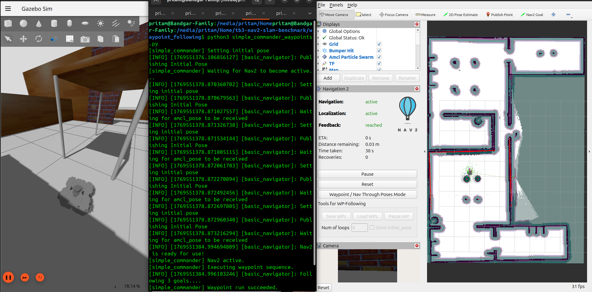

# 🤖 ROS2 Autonomous Navigation (TurtleBot3)


---

## 📋 Overview

Autonomous navigation project on TurtleBot3 Waffle in ROS2 Jazzy. Maps were generated using SLAM Toolbox (primary, recorded to rosbag2 MCAP) and Google Cartographer (monitored live via Foxglove). Single-goal and waypoint navigation via RViz confirmed the full stack was working before any constrained environments were attempted.

A routine demo through a **0.81m narrow doorway** failed consistently. Seven systematic tests followed. Tests 01–05 tuned Nav2 parameters — none worked. Test 06 switched to a rectangular footprint and uncovered the **"Letterbox Trap"**: the planner routed through an unsafe gap it geometrically fit through.

Test 07 reverted to a circular `robot_radius: 0.15` and decomposed the mission into 4 waypoints via the Nav2 Simple Commander API (`waypoint_following/simple_commander_waypoints.py`). Result: **100% success, zero collisions**.

---

## 🖼️ Visual Proof

### Nav2 Stack — How It's Wired

The failure is a **DWB Controller**-layer problem: the global planner finds a route, but the local planner can't execute it safely.

```
                          ┌─────────────────────────────────────────────────────┐
                          │                  Gazebo Simulation                  │
                          │             (turtlebot3_house.world)                │
                          └───────────────────────┬─────────────────────────────┘
                                                  │  /scan, /odom, /cmd_vel
                                                  ▼
                                     ┌─────────────────────────┐
                                     │        Nav2 Stack       │
                                     │                         │
                                     │  ┌─────────────────┐    │
                                     │  │  AMCL           │    │  ← Localization: "Where am I?"
                                     │  │  (localization) │    │     /map + /scan  →  /amcl_pose
                                     │  └────────┬────────┘    │
                                     │           ▼             │
                                     │  ┌─────────────────┐    │
                                     │  │  Global Planner │    │  ← Planning: "What's the full route?"
                                     │  │  (costmap +     │    │     /map  →  /plan
                                     │  │   path search)  │    │
                                     │  └────────┬────────┘    │
                                     │           ▼             │
                                     │  ┌─────────────────┐    │
                                     │  │  DWB Controller │◄───┼── ⚠️  Failure point: can't execute
                                     │  │  (local planner)│    │     /local_costmap → /local_plan → cmd_vel  
                                     │  └─────────────────┘    │
                                     └─────────────────────────┘
                                                 │
                                                 ▼
                                         ┌───────────────┐
                                         │  Visualization│
                                         │RViz / Foxglove│
                                         └───────────────┘
```

---

### 1. Mapping — The Foundation

#### SLAM Toolbox Map



*SLAM Toolbox occupancy grid. Used for all Nav2 tests.*

#### Cartographer Map



*Cartographer occupancy grid. Learning exercise only.*

#### Foxglove Live Dashboard — Cartographer Map Run



*Foxglove live dashboard during Cartographe map Nav2 Waypoiny follower goals(using RViz). Panels: 3D map, TF tree, velocity plots.*

#### Foxglove rosbag2 Visualization — SLAM Map run



*Foxglove rosbag2 visalization for SLAM Map using topics /aml_pose, global_costmap/costmap, local_costmap/costmap, /map, /scan, /local_plan, /plan.*

---

### 2. Initial Validation — Nav2 Goals and Waypoints via RViz

#### Single Goal — Nav2 Goal (RViz)



*Single goal set via 2D Goal Pose in RViz. Robot reaches it without hesitation.*

#### Waypoint Following — RViz Waypoint Mode



*Waypoint sequence set via Nav2 Waypoint Mode in RViz. Every waypoint reached, no recovery behaviors triggered.*

---

### 3. The Failure — The Letterbox Trap (Test 06)

Tests 01–05 tuned parameters. None worked. Test 06 switched to a rectangular footprint `[0.21, 0.165]` — the planner found a gap it geometrically fit through, but the local planner couldn't execute it safely. Goal aborted.



*Test 06: rectangular footprint caused the planner to route through an unsafe gap near a letterbox — the "Letterbox Trap." Full breakdown in [`docs/tuning.md`](docs/tuning.md).*

---

### 4. The Solution — 4-Waypoint Mission (Test 07)

The rectangular footprint was removed, `robot_radius: 0.15` restored — letterbox gap gone from the costmap. The mission was then decomposed into 4 waypoints via the Nav2 Simple Commander API. Each waypoint is a short, straight-line segment the planner can always handle.


*Test 07: all 4 waypoints visible in RViz. Path enters the doorway straight and centered. Every waypoint reached.*

#### Demo Video

*📹 Placeholder — full run video to be added here.*

#### Test 07 Result



*Placeholder — completed mission state in RViz.*

---

## ⚙️ Engineering Journey

| Phase | What Was Tried | Result | Why It Matters |
|---|---|---|---|
| Initial Validation | Single-goal and RViz waypoint navigation on both SLAM Toolbox and Cartographer maps | All passed | Confirmed the full stack (SLAM → AMCL → Nav2) worked correctly in open areas |
| Tests 01–05 | Tuned inflation radius, cost scaling, DWB critics, AMCL noise, reduced robot radius to 0.13 | All failed | Parameter tuning cannot create a valid path where geometry forbids one |
| Test 06 | Switched to precise rectangular footprint `[0.21, 0.165]` | Letterbox Trap | The planner exploited a ~0.2m gap the robot couldn't safely traverse |
| Test 07 | Reverted to circular `robot_radius: 0.15` + 4-waypoint script | **100% success** | Mission-level decomposition solved what local planner tuning could not |

---

## 🚀 How to Run

**Step 1 — Launch Gazebo:**
```bash
ros2 launch turtlebot3_gazebo turtlebot3_house.launch.py
```

**Step 2 — Generate the map with SLAM Toolbox:**
```bash
ros2 launch slam_toolbox online_sync_launch.py use_sim_time:=True
```
Drive the robot around until the map is complete. Save it:
```bash
ros2 run slam_toolbox lifelong_slam_toolbox --ros-args -p save_map:=results/maps/house_slam_toolbox_draft
```

> **Optional:** Cartographer can also map the same environment. See [`docs/runs.md`](docs/runs.md) for the launch command.

**Step 3 — Launch Nav2 with the SLAM Toolbox map:**
```bash
ros2 launch nav2_bringup bringup_launch.py \
  use_sim_time:=True \
  map:=results/maps/house_slam_toolbox_draft.yaml \
  params_file:=$(ros2 pkg prefix turtlebot3_navigation2)/share/turtlebot3_navigation2/param/waffle.yaml
```

**Step 4 — Run the 4-waypoint mission:**
```bash
python3 waypoint_following/simple_commander_waypoints.py
```

Waypoints:

| Waypoint | x | y | yaw | Role |
|---|---|---|---|---|
| WP1 | 4.5 | 5.3 | 1.57 | Stage perpendicular to doorway |
| WP2 | 3.0 | 2.5 | 1.57 | Straight through doorway into room |
| WP3 | 4.5 | 5.3 | 1.57 | Return to doorway |
| WP4 | 0.3 | 3.0 | 0.0 | Back to home base |

Full launch details and monitoring setup: [`docs/runs.md`](docs/runs.md)

---

## 📁 Directory Structure

```
ros2-turtlebot3-navigation/
├── config/
│   ├── slam_toolbox/            # SLAM Toolbox parameters
│   ├── cartographer/            # Cartographer parameters
│   ├── nav2/                    # Nav2 params (one file per test)
│   └── rviz/                    # RViz configurations
├── docs/
│   ├── setup.md                 # Environment & dependency setup
│   ├── runs.md                  # Launch sequence & monitoring
│   ├── tuning.md                # 7-test engineering log
│   └── troubleshooting.md       # Common issues & fixes
├── results/
│   ├── maps/                    # Generated maps (PGM + YAML)
│   ├── rosbags/                 # MCAP recordings (SLAM Toolbox & Nav2)
│   └── screenshots/             # Visual proof
│       ├── maps/                # SLAM comparison screenshots
│       ├── tuning/              # Test result screenshots (letterbox trap)
│       ├── nav2/                # Navigation screenshots (goals, waypoints, solution)
│       └── foxglove/            # Foxglove dashboard screenshots
└── waypoint_following/
    └── simple_commander_waypoints.py   # 4-waypoint mission script
```

---

## 🛠️ Tech Stack & Credits

| Technology | Role in This Project |
|---|---|
| **ROS2 Jazzy** | Robot middleware & communication layer |
| **Nav2** | Navigation stack (planning, control, AMCL localization) |
| **SLAM Toolbox** | Primary SLAM backend — map used for all navigation tests |
| **Google Cartographer** | Secondary SLAM backend — map generated for learning |
| **Gazebo Harmonic** | Physics simulation (TurtleBot3 house world) |
| **Foxglove Studio** | Live dashboard during the Cartographer mapping run |
| **rosbag2 / MCAP** | Data recording for SLAM Toolbox & Nav2 runs |
| **Python 3.12** | Waypoint mission script (Nav2 Simple Commander API) |

**Credits:** TurtleBot3 platform by [ROBOTIS](https://www.robotis.com). Nav2 by [Open Navigation](https://nav2.org). SLAM Toolbox by Steve Macenski. Cartographer by Google.

---

| Document | What's Inside |
|---|---|
| [`docs/setup.md`](docs/setup.md) | Install dependencies, build workspace |
| [`docs/runs.md`](docs/runs.md) | 4-step launch sequence + monitoring explained |
| [`docs/tuning.md`](docs/tuning.md) | Full 7-test log: the problem, the trap, the fix |
| [`docs/troubleshooting.md`](docs/troubleshooting.md) | Common issues & diagnostic commands |